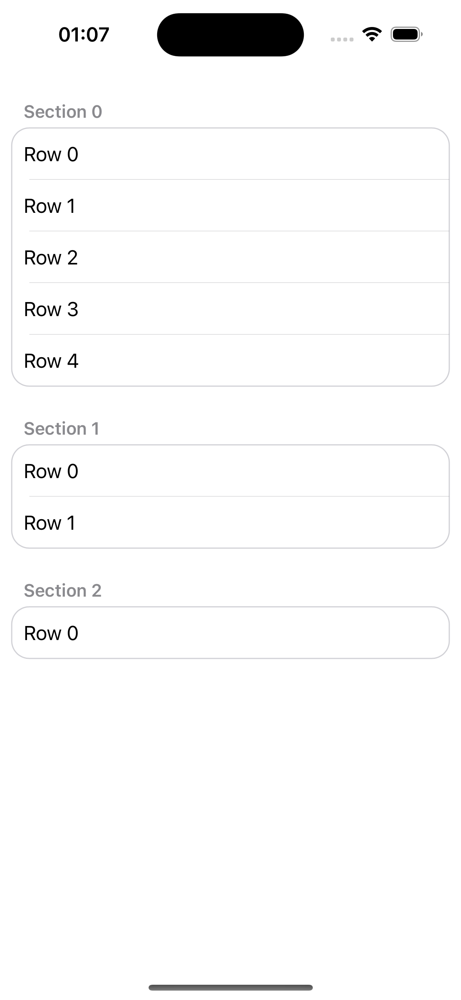
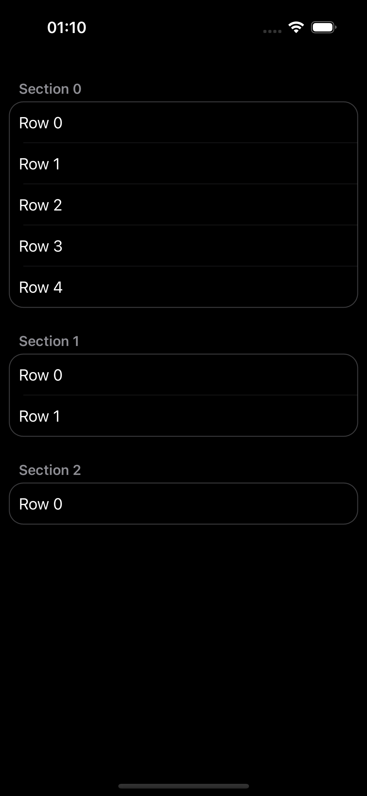

# Grouped Table View

### This code provides a custom UITableView implementation for UIKit ViewCode

  
  

---

  For more details about the paths and layers construction visit: <a href="https://stackoverflow.com/questions/66838135/what-are-the-tangent-parameters-found-in-the-addarc-method-for-swiftui">What are the tangent parameters found in the .addArc method for SwiftUI?</a>

